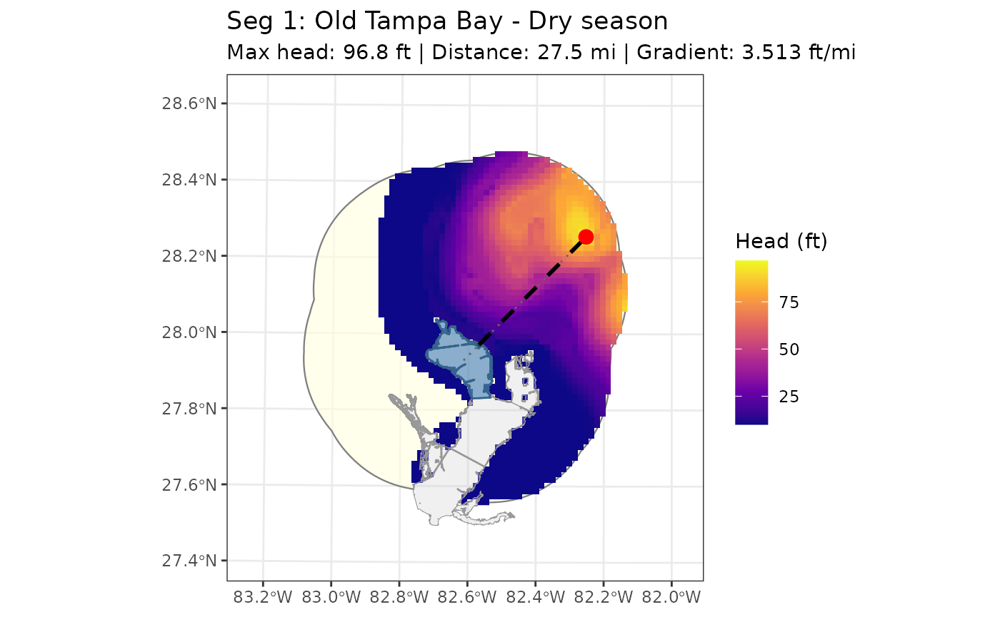
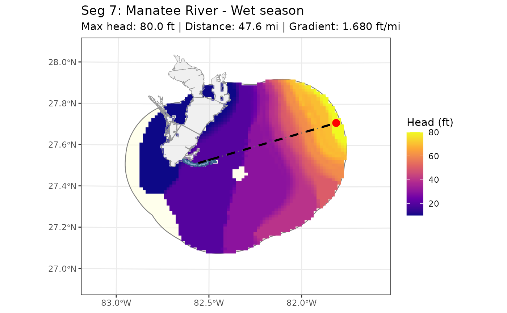

# Groundwater (GW)

``` r
library(tbeploads)
```

Groundwater loads to Tampa Bay are estimated using the three-aquifer
framework from Zarbock et al. (1994). The
[`anlz_gw()`](https://tbep-tech.github.io/tbeploads/reference/anlz_gw.md)
function computes monthly TN, TP, and hydrologic loads for all bay
segments.

## Methodology

Three aquifer types contribute to each bay segment each month.

**Floridan aquifer:** Flow is estimated with Darcy’s Law:

$$Q = 7.4805*10^{- 6}*T*I*L$$

where T is transmissivity (ft²/day), I is the hydraulic gradient
(ft/mile), and L is the flow zone length (miles). Q is in million
gallons per day (MGD). Transmissivity and flow zone length are fixed
constants per segment from Zarbock et al. (1994). Hydraulic gradients
are season-specific: months 1-6 and 11-12 are dry season; months 7-10
are wet season. The
[`util_gw_grad()`](https://tbep-tech.github.io/tbeploads/reference/util_gw_grad.md)
function computes gradients from FDEP potentiometric surface contours
for the dry and wet seasons (see below).

Monthly nutrient loads (kg/month) are:

$$Load = Q*C*8.342*30.5/2.2$$

where C is the TN or TP concentration in mg/L.

Monthly hydrologic load (m³/month) is:

$$Load = Q*3785*30.5$$

**Surficial and intermediate aquifers:** Loads are fixed monthly
constants per segment derived from 1995-1998 (surficial) and 1999-2003
(intermediate) SWFWMD monitoring data. These values have not changed
since the original analysis.

## Hydraulic gradient computation

Hydraulic gradients are computed from FDEP Upper Floridan Aquifer
potentiometric surface contour lines using
[`util_gw_getcontour()`](https://tbep-tech.github.io/tbeploads/reference/util_gw_getcontour.md)
and
[`util_gw_grad()`](https://tbep-tech.github.io/tbeploads/reference/util_gw_grad.md).

### Downloading and rasterizing contours

[`util_gw_getcontour()`](https://tbep-tech.github.io/tbeploads/reference/util_gw_getcontour.md)
downloads biannual FDEP contour lines (May = dry, September = wet) from
the Florida Geological Survey ArcGIS REST service. Rather than working
directly with the vector contour lines, the function rasterizes them to
a 1-mile grid using inverse distance weighting (IDW, 5-mile radius)
followed by iterative focal gap-filling. The spatial extent of the
download covers the Tampa Bay watershed (`tbfullshed`) buffered outward
by 40 miles to capture high potentiometric values outside of the
surficial subwatersheds that drive groundwater flow. The IDW radius was
deliberately set to 5 miles (rather than the contour spacing) to prevent
extrapolation into data-sparse coastal and northern areas.

``` r
contdry <- util_gw_getcontour("dry", 2022)
contwet <- util_gw_getcontour("wet", 2022)
```

The package datasets `contdry` and `contwet` contain pre-computed 2022
rasters stored as `PackedSpatRaster` objects. Unwrap them with
[`terra::unwrap()`](https://rspatial.github.io/terra/reference/wrap.html)
before use or pass them directly to
[`util_gw_grad()`](https://tbep-tech.github.io/tbeploads/reference/util_gw_grad.md)
and
[`util_gw_showgrad()`](https://tbep-tech.github.io/tbeploads/reference/util_gw_showgrad.md),
which unwrap automatically.

### Computing gradients

[`util_gw_grad()`](https://tbep-tech.github.io/tbeploads/reference/util_gw_grad.md)
finds the maximum potentiometric head within each segment’s search area,
then measures the distance from the shoreline to that high point using a
centroid-based transect:

1.  A line is drawn from the bay segment centroid to the max-head land
    cell.
2.  The portion of that line inside the bay polygon (from centroid to
    shoreline crossing) is subtracted from the total length.
3.  The remaining land-side distance is used as the gradient base.

This approach avoids measuring to an extreme geographic corner of the
shoreline (e.g., the northeast tip of Middle Tampa Bay), giving a more
representative transect.

Search areas to find the maximum head for each segment are controlled by
the `buf_segs` parameter, which buffers the subwatershed polygon outward
and removes bay water. Default buffer distances (calibrated against 2021
SAS reference values) are applied automatically:

- Dry season: Old Tampa Bay (seg 1) buffered ~19 miles to capture the
  potentiometric high north/northeast of the standard watershed
  boundary.
- Wet season: same as dry, plus Lower Tampa Bay (4), Terra Ceia Bay (6),
  and Manatee River (7) each buffered ~19 miles to unlock wet-season
  dynamic computation.

Zero-gradient segments (hardcoded, not computed dynamically) reflect
deliberate decisions from prior loading analyses (Zarbock et al. 1994):

- Boca Ciega Bay (segments 5 and 55), both seasons: the heavily
  urbanized coastal watershed has no meaningful Floridan Aquifer
  recharge directed toward the bay.
- Lower Tampa Bay (4), Terra Ceia Bay (6), Manatee River (7), dry season
  only: the potentiometric gradient is negligible during the dry season.

**Hillsborough Bay (segment 2)** uses a three-zone weighted average
(Polk County 0.4, Pasco County 0.3, Alafia River 0.3) following the
original flow net analysis in the SAS code.

**Benchmark warning:**
[`util_gw_grad()`](https://tbep-tech.github.io/tbeploads/reference/util_gw_grad.md)
compares computed gradients against 2021 SAS reference values and issues
a warning for any non-zero segment that deviates by more than 50%,
making it easy to detect anomalous potentiometric surfaces when running
future years.

``` r
util_gw_grad(contdry, season = "dry")
#>   bay_seg     grad
#> 1       1 3.513075
#> 2       2 2.790798
#> 3       3 1.249106
#> 4       4 0.000000
#> 5       5 0.000000
#> 6       6 0.000000
#> 7       7 0.000000
#> 8      55 0.000000
util_gw_grad(contwet, season = "wet")
#>   bay_seg     grad
#> 1       1 4.021441
#> 2       2 3.319684
#> 3       3 2.006550
#> 4       4 1.544803
#> 5       5 0.000000
#> 6       6 1.386061
#> 7       7 1.679699
#> 8      55 0.000000
```

### Visualising gradients

[`util_gw_showgrad()`](https://tbep-tech.github.io/tbeploads/reference/util_gw_showgrad.md)
produces a map for a single segment showing the potentiometric surface
within the search area, the centroid-to-head transect, and the computed
gradient.

``` r
util_gw_showgrad(contdry, season = "dry", seg = 1)
```



``` r
util_gw_showgrad(contwet, season = "wet", seg = 7)
```



## Floridan aquifer concentrations

Floridan aquifer TN and TP concentrations (mg/L) can be obtained from
the [Water Atlas API](https://dev.api.wateratlas.org) using
[`util_gw_getwq()`](https://tbep-tech.github.io/tbeploads/reference/util_gw_getwq.md).
The default stations are 18340 (CR 581 North Fldn) and 18965 (SR 52 and
CR 581 Deep), the two Pasco County Floridan aquifer monitoring wells
used in the 2022-2024 loading analysis. Old Tampa Bay uses the first
station mean only and Hillsborough Bay uses the arithmetic mean of both
station means. The rest of the bay segments retain fixed historical
values from the 1995-1998 SWFWMD analysis used in every loading cycle
through 2021.

``` r
wqdat <- util_gw_getwq()
```

When `wqdat = NULL` (the default in
[`anlz_gw()`](https://tbep-tech.github.io/tbeploads/reference/anlz_gw.md)),
hardcoded concentrations from the 2022-2024 analysis are used directly.

## Estimating groundwater loads

[`anlz_gw()`](https://tbep-tech.github.io/tbeploads/reference/anlz_gw.md)
takes potentiometric surface rasters for the dry and wet seasons as
required inputs, along with a year range. Gradients are computed once
from the supplied rasters via
[`util_gw_grad()`](https://tbep-tech.github.io/tbeploads/reference/util_gw_grad.md)
and applied to every year in the range.

The package datasets `contdry` and `contwet` are pre-computed 2022
rasters stored as `PackedSpatRaster` objects and can be passed directly:

``` r
gw <- anlz_gw(contdry, contwet, yrrng = c(2022, 2024))
head(gw)
#>   Year Month source        segment      tn_load     tp_load   hy_load
#> 1 2022     1     GW Boca Ciega Bay 0.0004188783 0.003957298 0.0132126
#> 2 2022     2     GW Boca Ciega Bay 0.0004188783 0.003957298 0.0132126
#> 3 2022     3     GW Boca Ciega Bay 0.0004188783 0.003957298 0.0132126
#> 4 2022     4     GW Boca Ciega Bay 0.0004188783 0.003957298 0.0132126
#> 5 2022     5     GW Boca Ciega Bay 0.0004188783 0.003957298 0.0132126
#> 6 2022     6     GW Boca Ciega Bay 0.0004188783 0.003957298 0.0132126
```

Load columns are in tons/month and `hy_load` is in million m³/month.

To run the analysis for a new year, first download updated
potentiometric surfaces from FDEP, then pass them to
[`anlz_gw()`](https://tbep-tech.github.io/tbeploads/reference/anlz_gw.md):

``` r
contdry <- util_gw_getcontour("dry", 2025)
contwet <- util_gw_getcontour("wet", 2025)
gw <- anlz_gw(contdry, contwet, yrrng = c(2025, 2025))
```

To pass concentrations retrieved from the Water Atlas API:

``` r
wqdat  <- util_gw_getwq()
gw_api <- anlz_gw(contdry, contwet, yrrng = c(2022, 2024), wqdat = wqdat)
```

## Temporal summary

Setting `summtime = 'year'` sums monthly loads to annual totals.

``` r
anlz_gw(contdry, contwet, yrrng = c(2022, 2024), summtime = 'year')
```

## References

Zarbock, H., A. Janicki, D. Wade, D. Heimbuch, and H. Wilson. 1994.
“Estimates of Total Nitrogen, Total Phosphorus, and Total Suspended
Solids Loadings to Tampa Bay, Florida.” 04-94. St. Petersburg, FL: Tampa
Bay National Estuary Program.
